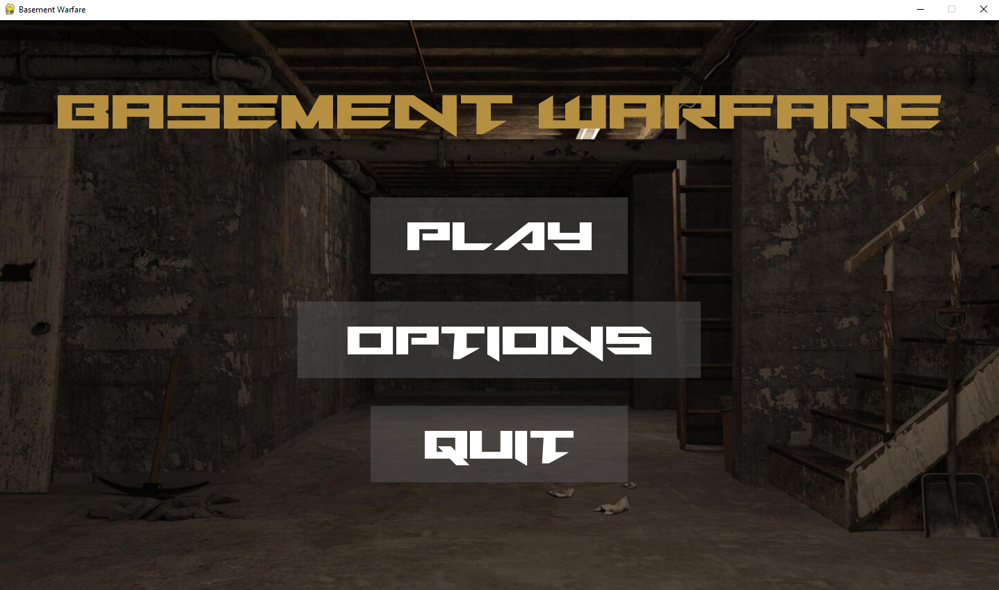
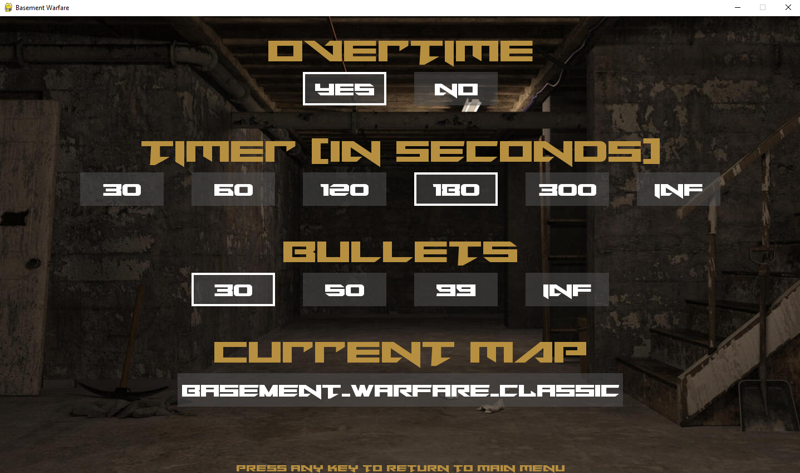
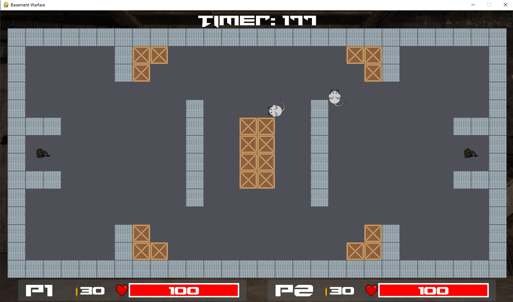
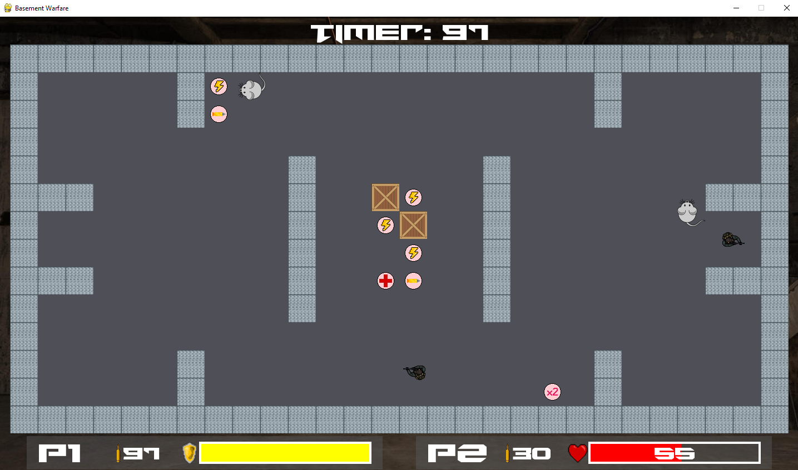
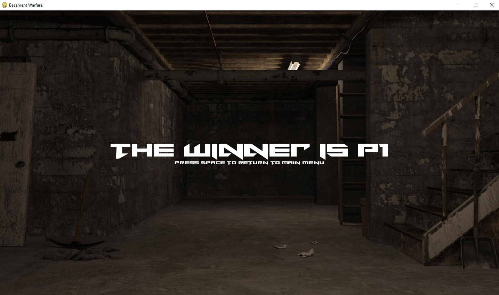

# Basement Warfare

Project for the FMI Introduction to Python course 2022/23 winter semester.

## Description
Basement Warfare is a 2D multiplayer shooter video game where two players battle against each other until one of them triumphs as a *Lord of the Basement*. Each player has gun with finite bullets unless specified in the options menu to have infinity number. The basement contains indestructible metal walls that cannot be passed and loot boxes which can give random bonus for the player that collects the drop when the crate is destroyed. Also, since it's a basement there are mutated AI mice that cannot be killed and also deal damage to the players. The winner of the game is the player with more health points at the end of the timer unless someone kills their opponent or a draw if players run out of ammo and the overtime mode is activated. In case of even health points the game goes to overtime and the winner is decided by '*Golden shoot*' - first player to hit the other wins.

## Start menu

## Options menu

### Overtime
When turned on, Overtime mode allows players to settle their brawl for sure no matter the circumstances. The Overtime mode is activated if the timer runs out or both players have no bullets left. Then they get infinity bullets and all of the mice are destroyed. The winner of the game is the first person to hit the other.
### Timer
Timer can be set to 30, 60, 120, 180 or 300 seconds. In addition you can set it to *INF* which corresponds to no timer mode. If the Overtime mode is off and both players run out of ammo then the game ends in a draw.
### Bullets
Bullet amount can be set to 30, 50, 99 or INF.
### Map
Everyone can create map for the game. A map is a text file that must meet the exact definition requirements to be valid for play. Here is an example mao which is the Default map for the game:

    ############################
    #     #cc    m     cc#     #
	#     #c            c#     #
	#                          #
	#         #      #         #
	###       #  cc  #       ###
	#11       #  cc  #       22#
	#11       #  cc  #       22#
	###       #  cc  #       ###
	#         #      #         #
	#                          #
	#     #c            c#     #
	#     #cc         mcc#     #
	############################

The map must be 28x14 rectangle that is surrounded by impenetrable metal walls - `#`. Each and every symbol contained within this rectangle corresponds to an item on the map. The game's environment is made up of squares and a symbol serves as a representation of one such square. Unix-style newlines, consisting solely of the newline character `\n`, should be utilized. The following is a breakdown of the significance of each symbol:

 - `#` - metal wall.
 - `c` - crate
 - `1` - player 1 position, it must be 2x2 square.
 - `2` - player 2 postion, it must be 2x2 square.
 - `m` - mouse

Users can upload a map from everywhere within their PC disk space. If a map is invalid, an error message will be displayed containing the reason why the map is invalid.

## Game

### Player
Each player has 100 health points and deals 50 damage to their opponent. The gun has 0.4 seconds reload timer so the players cannot spam the shot button. Additionally, If a player takes damage they become untargetable for the next 2 seconds.

### Players controls
| Action | Player 1 | Player 2 |
| -------- | -------- | -------- |
| Movement - UP | W | UP (arrow key) |
| Movement - DOWN | S| DOWN (arrow key) |
| Movement - LEFT | A | LEFT (arrow key) |
| Movement - RIGHT | D | RIGHT (arrow key) |
| Shoot | SPACE | ENTER (RETURN) |
| Lock rotation | Q | BACKLASH (\\) |

### Crates

Crates are wooden boxes that are likely to drop some special bonuses when destroyed to the player who goes through them. Each crate has 80 health points. The bonuses are:
| Powerup | Description | Percantage of drop |
| -------- | -------- | -------- |
| Bullets | Adds 20 bullets if the player has less than the maximum amount of 99. | 40 |
| Health | Restores 25 health points. There is no threshold for the maximum amound of health for each player. | 15 |
| Shield | Gain shield which blocks the next damage taken. If the game goes to overtime and a player has a shield, the shield is removed. | 15 |
| Speed | Gain +1 movement speed for 10 seconds | 15 |
| Damage | Gain x2 damage for 10 seconds | 5 |
| Nothing | *I think it's obvious* | 10 |

### Mice

Mice are untargetable AI objects that deal 15 damage to the players. They can move up, down, left and right. Their moving direction is changed when they hit a wall or a crate and additionally there is a chance of changing direction at random.

### Winner

## Installation

In order to run the game, you must have the following installed on your machine:

- Python 3.10
- Pygame 2.1.2
